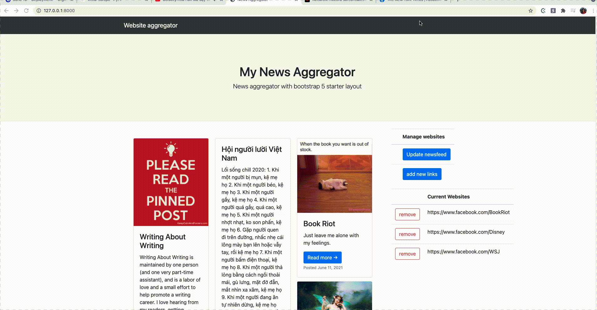
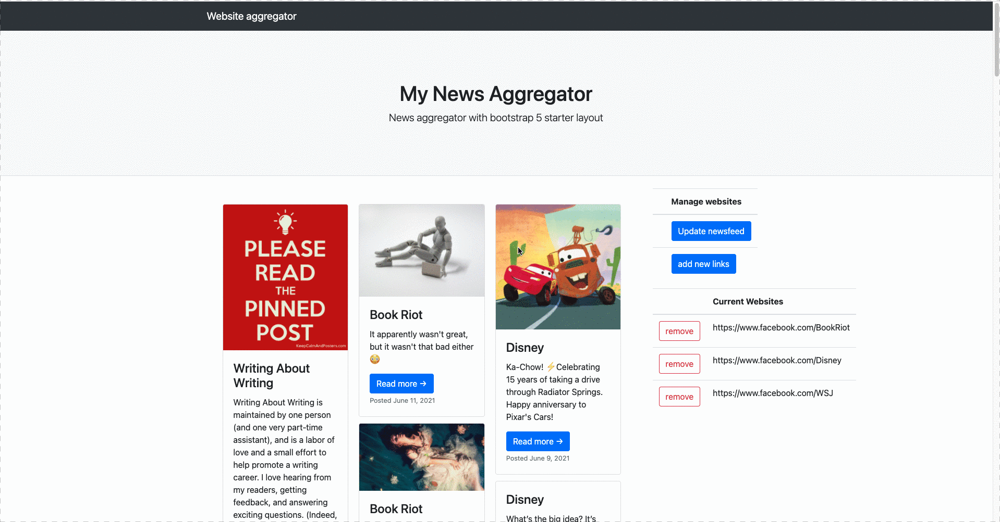

# Social media content aggregator

## About

This social media content aggregator is made to reduce our urge to scroll through social media platforms.

The newsfeed is designed poorly on purpose: 

- We dump all of the posts into three columns (instead of one) to overwhelm users with posts, reducing their urge to scroll through everything.
- We only correct the newest posts from the pages, meaning that the users might not always get something new every time they press the button. This is the exact opposite of facebook, when the user intuitively knew that they would be rewarded with new information everytime something reloads.
- We ignore comments and reactions to discourage users interactions with posts.
- It's easy to delete links, but users need to take extra steps to add more platforms by going to another site.

## Check it out

Here's how the user can modify the pages they want to collect posts from. Here, we added [NY Times Facebook Page](https://www.facebook.com/nytimes).



The user can press "update newsfeed" to make the newsfeed collect posts from the current websites. We can see that some New York Times posts appear in the website after updating is completed.




## Installation

Setting up the environment.

First, make a folder. This folder will store the environment and the source code. More about python environment [here](https://docs.python.org/3/library/venv.html).

```
mkdir social_media
cd social_media
git clone https://github.com/trangdang168/social_media_aggregator.git
python3 -m venv env
```

If you use visual studio code, in the .vscode folder, add a settings.json file to direct the debugger to using 
this environment.

#### settings.json

```
{
    "python.pythonPath": "env/bin/python"
}
```

Install the packages.

```
cd social_media_aggregator
pip install -r requirements.txt
```

Getting the app ready. If after adding a new model, redo these steps. Refer to this creating [new model link](https://docs.djangoproject.com/en/3.2/intro/tutorial02/) if there are issues:

```
python manage.py makemigrations
python manage.py migrate
```

## TODO list
Can be found at [TODO.md](TODO.md)

## Credits

Borrowed heavily from DataFlair-News-Aggregator and bootstrap blog home template.

### DataFlair-News-Aggregator developed by Karan Mittal
This Web application scrapes news articles from websites like theonion.com and present it in a webpage. This webapp combines the concept of django with web crawling. 

this project is explained on the platform DataFlair [here](https://data-flair.training/blogs/django-project-news-aggregator-app/).

### Bootstrap template

We used the [Blog Home](https://startbootstrap.com/template/blog-home) template from Bootstrap.
